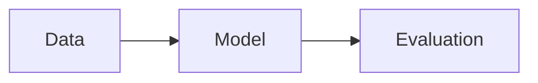

# Authoring guide

Copy-paste patterns for adding content to this course. Every learning object is
a **folder**, and the folder's name prefix is what tells Tutors how to render it.

Two rules underlie everything below:

1. **No spaces in folder or file names.** Use `talk-01-neural-networks`, never
   `Talk 01 Neural Networks`.
2. **Companion files share the markdown file's stem.** If the markdown is
   `talk-01-attention.md`, the PDF must be `talk-01-attention.pdf`. A mismatch
   produces a card with nothing behind it.

Run `python3 validate.py` after any change and both rules are checked for you.

---

## Talk — a slide deck

The main lecture object. Landscape PDF, rendered 16:9, one slide at a time.

```
unit-01-lecture/
└── talk-01-attention/
    ├── talk-01-attention.md      title + summary for the card
    └── talk-01-attention.pdf     the deck
```

`talk-01-attention.md`:

```markdown
---
order: 1
icon:
  type: vscode-icons:file-type-pdf2
---

# Week 10 Lecture Slides

Self-attention as content-based retrieval.
```

The first heading is the card title. The line beneath it is the card summary —
keep it to one or two sentences.

### Replacing a placeholder deck

Every teaching week already has a four-slide placeholder. Export your real deck
to PDF and overwrite the file, keeping the name identical. Nothing else changes:
the card title, summary, icon and URL all live in the `.md` file.

### Slides in markdown instead of PDF

Drop the PDF and add a `.marp` file with the same stem:

```
talk-02-explore/
├── talk-02-explore.md
└── talk-02-explore.marp
```

```markdown
---
marp: true
theme: default
paginate: true
---

# First slide

- a point
- another point

---

# Second slide

Content.
```

### A talk that is only a video

A `talk-*` folder with a `videoid` file and no PDF renders as a video card:

```
talk-03-guest-lecture/
├── talk-03-guest-lecture.md
└── videoid                  contains: Hfw1lbErjws
```

### A talk shown full-width on the topic page

Rename the folder to `paneltalk` and it renders directly onto the parent topic
rather than as a card.

---

## Tutorial — a portrait document

Same structure as a talk, different prefix, portrait orientation. This is what
the Week 1 reference booklet uses. Reach for it for booklets, problem sheets
and anything A4.

```
tutorial-01-reference-booklet/
├── tutorial-01-reference-booklet.md
└── tutorial-01-reference-booklet.pdf
```

A `tutorial-*` folder with only markdown and no PDF is also valid — it renders
as a web page, grouped separately from notes.

---

## Note — a single web page

```
note-01-lecture-outline/
├── note-01-lecture-outline.md
├── img/            optional, for images and short videos
└── archives/       optional, for zips linked from the page
```

Add `[[toc]]` near the top of a long note for an automatic table of contents.

Images are referenced relatively and must live in `img/`:

```markdown

```

---

## Book — a multi-step lab

One markdown file per step, named `[sort-key].[short-title].md`. The sort key
orders them; the short title is what appears in the sidebar on narrow screens.

```
book-01-know-your-data/
├── 00.Lab-01.md         first step — its heading becomes the lab card title
├── 01.Profile.md
├── 02.Distributions.md
├── img/
└── archives/
```

Only the first step carries frontmatter:

```markdown
---
order: 1
icon:
  type: fluent:beaker-24-filled
  color: "#2D7FF9"
---

# Week 01 Lab — Know Your Data

What the lab produces.
```

`labStepsAutoNumber: true` is set in `properties.yaml`, so steps are numbered
automatically in the display regardless of the sort key.

To link to another step in the same lab, take its URL and drop the domain:

```markdown
[see step 4](/lab/ai-principles/topic-01-data-and-the-ml-workflow/unit-02-lab/book-01-data-and-the-ml-workflow/04)
```

A `book-*` folder containing a PDF instead of steps renders as a PDF lab —
useful for problem sheets that belong with the labs.

---

## Web — an external link

```
web-05-something/
├── web.md          title + summary
└── weburl          the URL, one line, nothing else
```

`web.md`:

```markdown
---
order: 5
---
Fairlearn

Group fairness metrics and mitigation algorithms.
```

Note there is no `#` on the title line here — either style works, but stay
consistent within a unit.

---

## Archive — a downloadable zip

For lab starter files, datasets and notebooks.

```
archive-01-week1-files/
├── archive-01-week1-files.md
└── archive-01-week1-files.zip
```

---

## Notebook — an interactive Jupyter notebook

Rendered in the browser, with outputs behind a click-to-reveal.

```
notebook-01-eda/
├── notebook-01-eda.md
└── notebook-01-eda.ipynb
```

---

## GitHub repository link

```
github-01-labs/
├── github-01-labs.md
└── githubid            full repo URL
```

---

## Video

### Full-width on the topic or unit page

```
unit-01-lecture/
└── panelvideo/
    ├── panelvideo.md      just the title, one line
    └── videoid            the id
```

`videoid` formats:

| Host | Contents of `videoid` |
|---|---|
| YouTube | `Hfw1lbErjws` |
| YouTube, clipped | `Hfw1lbErjws?start=106&286` (seconds) |
| HEAnet | `heanet=7e4f1e9afedb40d5996d0703702eaaa4` |
| Panopto | `panopto=setu-ie.cloud.panopto.eu\|f285d4a8-…` |

### Inside a note or lab step

Embedded YouTube player:

```markdown
::video[src="O6Jh_1bxDs4"]::
```

A short video bundled in `img/`:

```markdown
::video[src="./img/demo.mov" poster="img/poster.png"]::
```

---

## Card ordering and icons

Default order within a unit is: talk, lab, note, web, github, archive. Override
it with frontmatter:

```markdown
---
order: 2
icon:
  type: fluent:beaker-24-filled
  color: "#2D7FF9"
---
```

Icons come from [Iconify](https://icon-sets.iconify.design/). If a folder has
no image file, the icon is used instead — which is why this course ships with
no images and still renders properly. To use a real image instead, drop it in
with the same stem as the markdown file.

Icons already used in this course:

| Purpose | Icon |
|---|---|
| Lecture slides | `vscode-icons:file-type-pdf2` |
| Reference booklet | `fluent:book-open-24-filled` |
| Lecture outline note | `fluent:notepad-24-filled` |
| Lab | `fluent:beaker-24-filled` |
| Lab files archive | `fluent:folder-zip-24-filled` |
| Milestone | `fluent:clipboard-task-24-filled` |

---

## Markdown extras

**LaTeX**, via KaTeX, in notes and labs:

```latex
$x = \frac{-b \pm \sqrt{b^2 - 4ac}}{2a}$
```

**Mermaid** diagrams, in any markdown:

````markdown

````

Flowchart, sequence, class, state, ER, Gantt and pie diagrams are all
supported.

---

## Adding a whole new week

```bash
mkdir -p topic-13-new-thing/unit-01-lecture/talk-01-new-thing
mkdir -p topic-13-new-thing/unit-02-lab/book-01-new-thing
```

Then create, at minimum:

- `topic-13-new-thing/topic.md`
- `unit-01-lecture/unit.md`
- `unit-01-lecture/talk-01-new-thing/talk-01-new-thing.md` + `.pdf`
- `unit-02-lab/unit.md`
- `unit-02-lab/book-01-new-thing/00.Lab-13.md`

Add the week to `calendar.yaml`, then run `python3 validate.py`.
