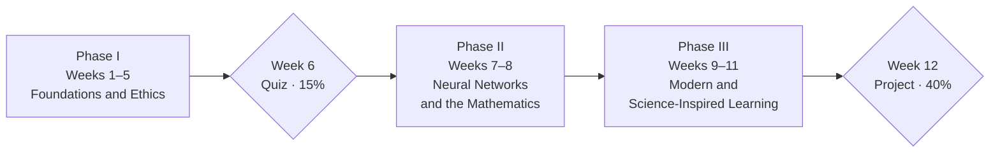

# The Twelve Weeks

Map and Rationale

## Three phases and two milestones

| Phase | Span | Share |
|---|---|---|
| Phase I — Foundations and Ethics | Weeks 1 to 5 | 50% |
| Phase II — Neural Networks and the Mathematics | Weeks 7 and 8 | 20% |
| Phase III — Modern and Science-Inspired Learning | Weeks 9 to 11 | 30% |

Week 6 is a quiz and reflection milestone. Week 12 is final-project delivery.
Both are run jointly by the teaching team, and neither carries new teaching
content.

## The weekly rhythm

Each teaching week is a **90-minute lecture** plus a **lab**. There are ten
teaching weeks — 1 to 5 and 7 to 11 — split evenly between the two lecturers,
five each.
